# Assistant-PoE as a Character-Centered Intelligence System

## A Retrospective Research Report on What This Repository Has Already Built

**Date:** 2026-03-22  
**Repository:** `assistant-PoE`  
**Primary framing:** every system in this repo exists to improve a specific player character  
**Current active default character:** `PhysicalDamage` (`tinycrops#3233`, `Mirage`, `pc`) via `defaults.env`

## Abstract

This repository has already crossed the line from "a pile of scripts" into a character-centered operating system for Path of Exile play. Its implemented capabilities now span live account ingestion, headless Path of Building stat extraction, per-character memory ledgers, market valuation, trade-query generation, Discord-facing memory publication, and OpenAI-backed build reporting with observability artifacts.

The most important architectural achievement is not any individual command. It is the emergence of a feedback loop in which a character becomes a durable object with memory, snapshots, observations, milestones, and next actions. In this repo, the character is treated as an evolving report card of player understanding rather than as a temporary API payload. That change in viewpoint has already shaped the codebase, the data model, and the outputs.

This report documents what has been built so far, how the parts fit together, where the evidence lives on disk, and what design direction is already visible in the current implementation.

## Executive Summary

### What exists today

- Live Path of Exile account and character retrieval
- Headless Path of Building snapshot extraction and panel-stat differencing
- Durable character ledgers under `characters/<slug>/ledger.json`
- Append-only journals for character events
- Archived stat-watch artifacts for reproducibility
- Market valuation using `poe.ninja`
- Trade API search with rate-limit telemetry
- Discord publication for `LOG`, `LEARN`, and `NEXT`
- OpenAI-generated build intelligence cards with observability traces
- A growing multi-character dataset spanning progression, gear shifts, and economic state

### What is novel here

- The repo does not just answer questions about a character; it maintains continuity of understanding over time.
- Headless PoB is used as a gating truth source for progression-sensitive trade advice.
- The ledger unifies live API facts, derived stats, market facts, and action prompts into one character memory object.
- Generated outputs are increasingly auditable through run artifacts, JSONL logs, and archive snapshots.

## System Thesis

The central thesis embodied by this codebase is:

> A Path of Exile character should be modeled as a living intelligence object, not merely a current-state snapshot.

That thesis appears repeatedly in the implementation:

- `defaults.env` defines the active character context.
- `poe_stat_watch.py` refreshes state from live account data and headless PoB.
- `character_ledger.py` preserves persistent memory per character.
- `weighted_trade_search.py` refuses progression-sensitive searches when the PoB basis is stale.
- Market outputs become action prompts, not just valuation tables.
- Discord and build cards externalize the repo's internal understanding into reusable human-facing artifacts.

## Research Questions

This report evaluates the repository against four practical questions:

1. Has the project achieved character persistence rather than one-shot automation?
2. Has it connected gameplay state to actionable economic and gearing decisions?
3. Has it made model-assisted analysis reproducible enough to trust and iterate?
4. Has the repo structure begun to reflect a coherent product, even before formal reorganization?

## Method and Evidence Base

This report is based on direct inspection of the current repository structure, implementation modules, ledgers, logs, and existing docs.

### Primary code artifacts inspected

| Area | Evidence |
| --- | --- |
| Live character intake | `poe_character_sync.py` |
| PoB-backed stat snapshots | `poe_stat_watch.py` |
| Character memory model | `character_ledger.py` |
| Market sync | `poe_market_pipeline.py` |
| Trade execution | `trade_api.py`, `weighted_trade_search.py` |
| Persona publishing | `discord_persona_sender/discord_persona_sender.py` |
| Build reporting | `openai_build_intel_card.py`, `post_build_intel_card.py` |
| Observability | `observability/`, `observability_viewer.py` |
| Historical narrative | `README.md`, `docs/DISCORD_PERSONA_PIPELINE.md`, `docs/session-2026-02-21-level1-to-act2.md` |

### Current repository evidence snapshot

| Metric | Count |
| --- | ---: |
| Characters with ledgers | 4 |
| Character journals | 4 |
| Build-intel run artifacts | 4 |
| Archived stat-watch files | 9 |
| Trade rate-limit events logged | 46 |
| Discord publish log entries | 10 |

## High-Level Architecture

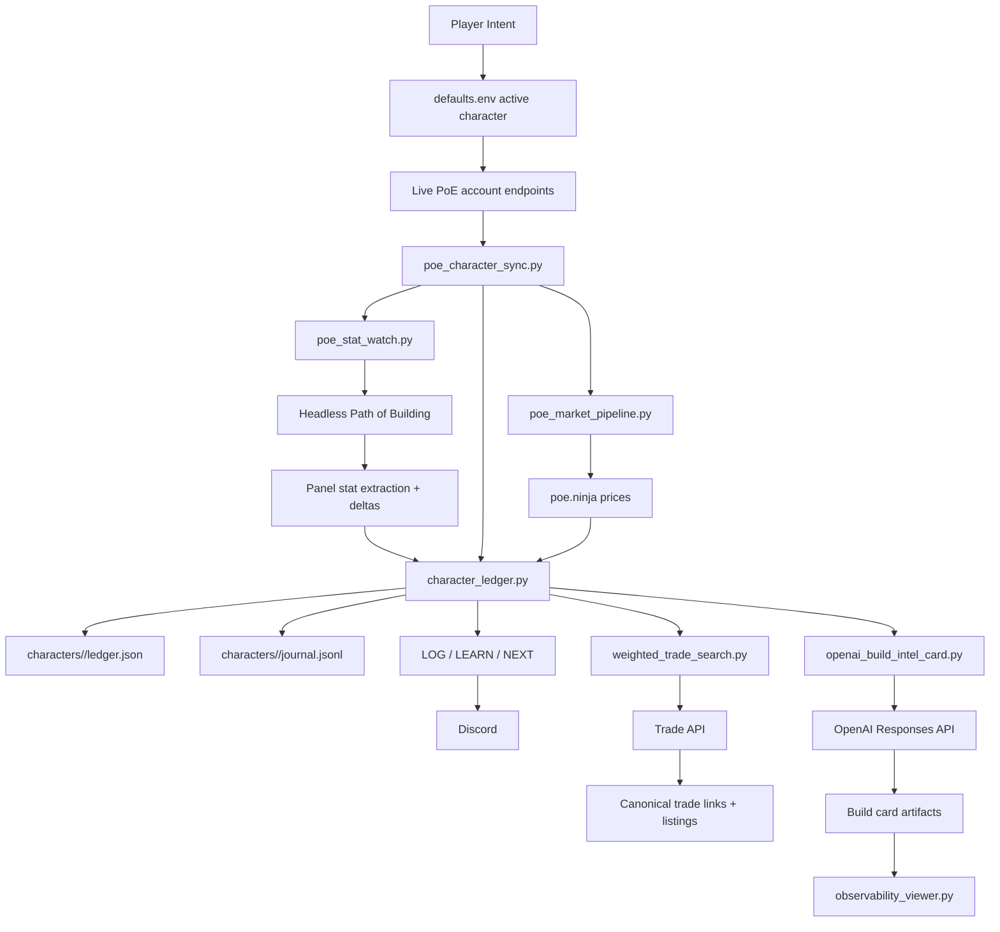

## Repository Morphology

Even before cleanup, the repo already clusters into several meaningful layers.

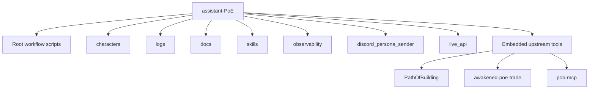

### Interpretation

This layout is messy at the root, but not random. The current sprawl is actually a sign of growth:

- root Python files represent operational entrypoints
- `characters/` contains durable identity-scoped memory
- `logs/` contains generated evidence and telemetry
- `skills/` contains procedural expertise
- embedded upstream repos show a deliberate strategy of bringing proven game tooling into the same workspace

The reorganization should therefore clarify existing domains, not invent them.

## The Character as the Unit of Computation

The strongest pattern in the codebase is that the character has become the main computational unit.

### Character memory model

Each character ledger already contains a surprisingly rich object:

- identity
- account and realm linkage
- league and class metadata
- latest live confirmation timestamp
- latest PoB-backed snapshot
- latest market snapshot
- observations
- milestones
- source file paths
- optional snapshot history

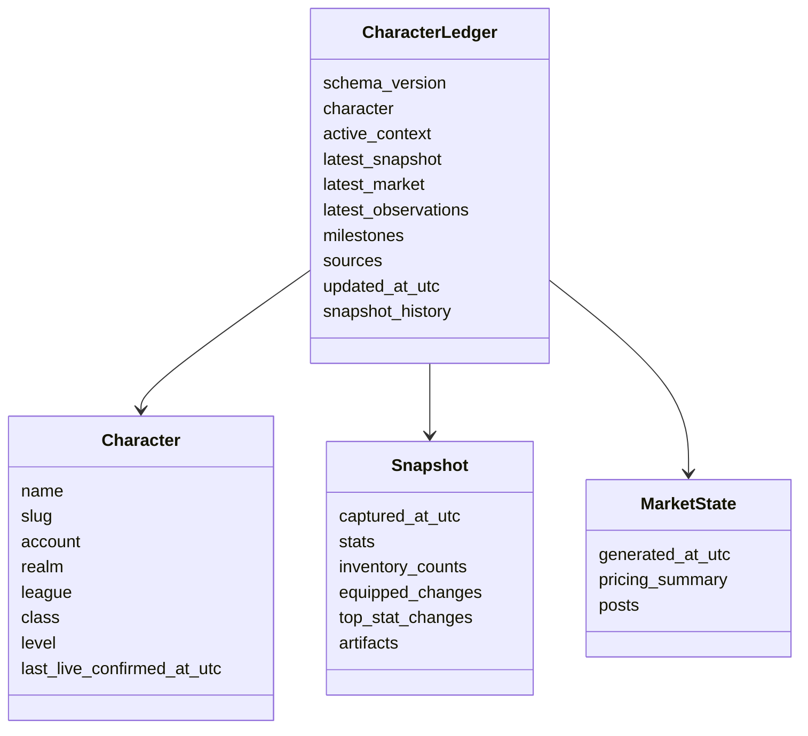

### Why this matters

This is the difference between:

- "fetching a character"
- and "maintaining a remembered evolving character"

That distinction is the foundation for everything else in the repo.

## Workflow 1: Live Character Ingestion

`poe_character_sync.py` implements the account-facing intake layer.

### What it does

- normalizes account names across realms
- queries `character-window/get-characters`
- resolves canonical account naming
- optionally fetches passive skills
- optionally fetches items
- supports `POESESSID` when privacy blocks public access
- includes an onboarding flow that mirrors how a real player would authenticate and select a character

### Research significance

This file establishes that the project is not operating from hand-entered build fantasies. It is grounded in live account reality. The user’s actual character is the source object, and everything downstream is meant to inherit from that truth.

## Workflow 2: Headless PoB Stat Watch

`poe_stat_watch.py` is the most important bridge in the system because it converts live account state into mechanically meaningful build state.

### Key contributions

- runs a headless PoB flow
- extracts `offence`, `defence`, `misc`, and `charges`
- compares current extracted stats against the previous run
- records equipped item changes
- summarizes inventory footprint
- archives immutable snapshot artifacts
- updates the character ledger with observations and milestones

### Core processing pipeline

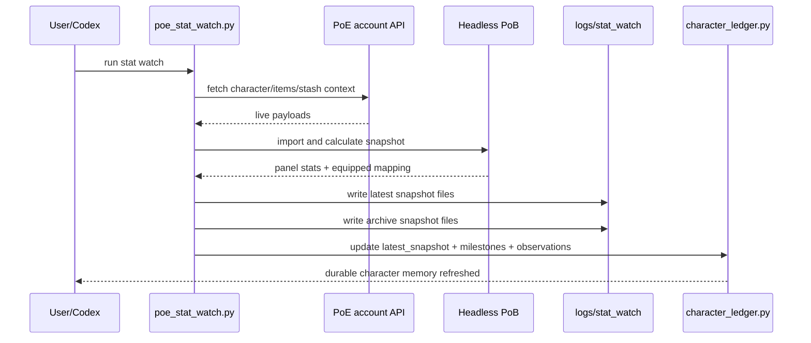

### Scientific value of this step

This is the point where the repo stops being a generic account scraper and becomes a build-analysis instrument. Headless PoB provides a consistent mechanical lens through which item swaps, level progression, and stat deltas can be interpreted.

## Workflow 3: Market Intelligence

`poe_market_pipeline.py` attaches economic meaning to the character state.

### What it does

- uses live item payloads
- pulls current `poe.ninja` economy data
- prices currency, uniques, and divination cards
- estimates known value in chaos
- computes coverage
- turns that into `LOG`, `LEARN`, and `NEXT`
- writes the results back into character memory

### Market flow

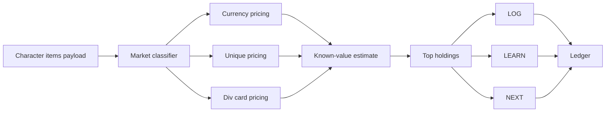

### Important limitation already understood by the code

The system explicitly knows that rare gear is underpriced by this lightweight market layer. That self-awareness matters. The repo is not pretending to have solved all valuation problems; it knows its coverage boundaries and routes the user toward trade checks when needed.

## Workflow 4: Trade as a Controlled Action, Not Just Search

`weighted_trade_search.py` and `trade_api.py` transform the repo from passive observation into active recommendation infrastructure.

### Key design choices

- searches are weighted, not just filter-based
- search status defaults to `securable` rather than `online`
- the character’s live level and league are refreshed before building a query
- stale headless PoB snapshots block progression-sensitive advice by default
- trade API calls are rate-limited and logged

### Why this is strong design

This is a notable repository-level insight:

> trade recommendations should not be allowed to outrun the freshness of the build understanding they are based on

That rule is already encoded in the software. It is one of the clearest signs that the repo has a real internal philosophy rather than just a collection of utilities.

### Trade decision guardrail

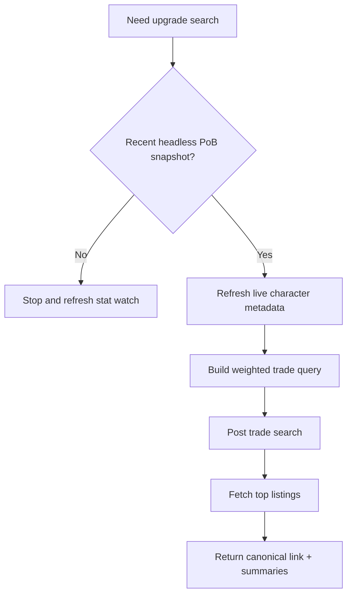

## Workflow 5: Externalized Memory Through Discord

The Discord persona subsystem converts internal state into socialized memory.

### Why this matters

A repo like this can easily become rich internally but invisible externally. The `discord_persona_sender` subsystem solves that by broadcasting structured posts:

- `LOG`: what happened
- `LEARN`: what the system inferred
- `NEXT`: what to do next

This makes the repo useful across sessions and beyond the terminal itself.

### Communication loop

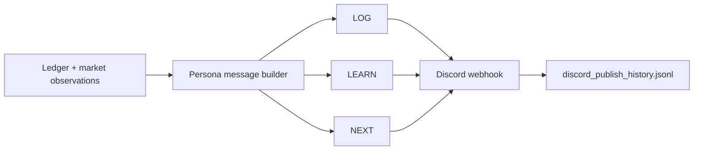

### Deeper significance

This is not just notification plumbing. It is a memory-formation protocol. The project is teaching itself to say:

- what changed
- what that means
- what action follows

That is the seed of a real coaching loop.

## Workflow 6: LLM Build Intelligence With Auditability

`openai_build_intel_card.py` adds a model-assisted narrative and planning layer, but does so with better discipline than a one-off API call.

### What is already implemented

- deterministic snapshot loading
- versioned prompts
- JSON-schema constrained outputs
- token budgeting
- local artifact persistence
- observability hooks
- Discord posting support

### Build-intel pipeline

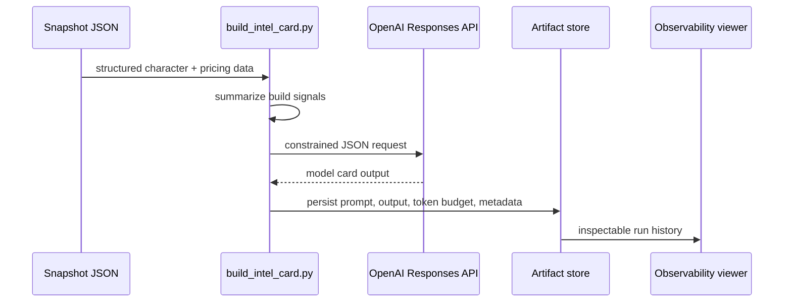

### Why this matters

The impressive part is not simply "the repo uses an LLM." The impressive part is that it tries to make LLM outputs replayable, inspectable, and bounded. That is exactly the right instinct for a serious assistant workflow.

## Empirical Character Evidence

The repo already contains multiple character case studies.

### Character inventory

| Character | Status visible in ledger | Notable evidence |
| --- | --- | --- |
| `CollabWitch_Codex` | historical progression tracked | early campaign to stronger Elementalist state with large gear-driven stat increases |
| `JungFub` | market + PoB tracked | 113 chaos known value, 47% priced coverage, archived snapshot history |
| `JUNGFUBTOO` | high-value market case | Headhunter-centered state with 6954.2 chaos known value |
| `PhysicalDamage` | active default scaffold | early progression note preserved; awaiting fresh stat-watch refresh |

### Example of progression memory already achieved

`docs/session-2026-02-21-level1-to-act2.md` shows a full narrative from beach baseline to Act II village with measured stat deltas at each checkpoint. This is important because it proves the project can already tell a progression story in terms of:

- equipment transitions
- survivability changes
- damage changes
- milestone checkpoints

This is already far more useful than a static gear dump.

## Economic Evidence

The ledgers show three qualitatively different economic situations:

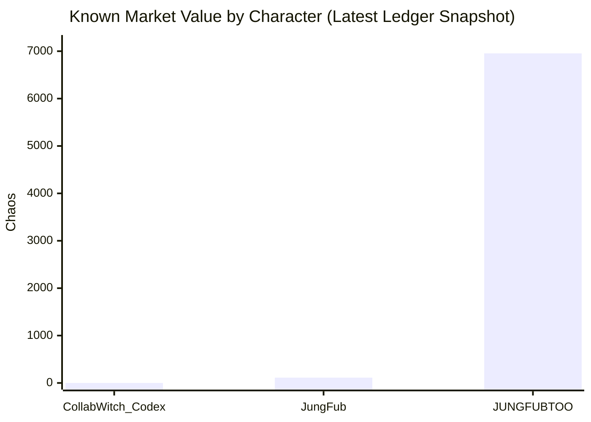

### Interpretation

- `CollabWitch_Codex` demonstrates the low-liquidity early progression case
- `JungFub` demonstrates a modestly capitalized progression state
- `JUNGFUBTOO` demonstrates a high-value inventory where market awareness materially changes decisions

This spread is healthy for the repo because it exercises the same workflows against very different account states.

## Temporal Intelligence and Reproducibility

One of the strongest qualities in the current implementation is temporal discipline.

### Evidence of temporal thinking

- JSONL append-only logs
- archived PoB snapshot artifacts
- milestones sorted by timestamp
- stale snapshot blocking for trade advice
- token-usage ledgers for model calls
- build-intel artifacts stored by timestamp

### Temporal data architecture

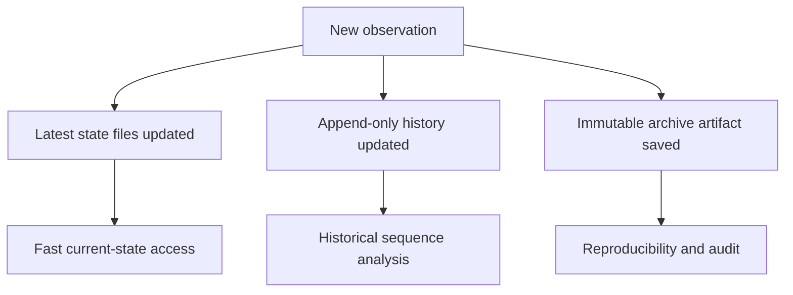

This is exactly the right shape for a system that wants to evolve into a "living organism" around character data.

## Observability and Meta-Operations

The project is not only instrumenting the game-facing workflows; it is beginning to instrument itself.

### Present observability layers

- `logs/dspy_observability.jsonl`
- `logs/openai_token_usage.jsonl`
- `logs/build_intel_runs/*.json`
- `observability/` package
- `observability_viewer.py`

### Implication

This means the repo has started to care about second-order questions:

- What did the model see?
- What did it output?
- How many tokens did it spend?
- Can we inspect a run after the fact?

That is a major maturity signal.

## Design Patterns Already Emerging

Several repo-wide patterns have clearly emerged.

### 1. Character-scoped persistence

State is not global in the abstract. It is anchored to a specific character slug.

### 2. Latest plus history

The repo uses a practical dual model:

- latest files for operational simplicity
- append-only or archived records for history and trust

### 3. Truth layering

Different truths come from different sources:

- live API truth
- PoB mechanical truth
- market truth
- model-assisted interpretive truth

The repository mostly keeps these layers distinguishable, which is good architecture.

### 4. Action orientation

Outputs usually terminate in next-step guidance rather than stopping at description.

### 5. Auditability over vibes

Artifacts and logs are increasingly first-class outputs, not side effects.

## Known Gaps and Friction

The repo is promising, but the current state also reveals a few structural tensions.

### Root-level congestion

Too many operational scripts currently live at the top level, making the repo feel more chaotic than it actually is.

### Naming redundancy

There are unnecessary `poe`/`PoE` prefixes in places where folder context could carry the domain meaning more cleanly.

### Mixed ownership of concepts

The repo currently mixes:

- apps
- libraries
- datasets
- logs
- vendored dependencies

at the same visual depth.

### Partial subsystem isolation

`live_api`, `discord_persona_sender`, and `observability` are recognizable subsystems but are not yet presented as such in the directory structure.

These are organizational problems, not conceptual failures. In fact, they mostly exist because the conceptual model has grown faster than the file layout.

## What Has Been Achieved, In Plain Terms

The simplest honest summary is this:

1. The repo can identify and refresh a real player character from live PoE endpoints.
2. It can convert that character into mechanically meaningful PoB-backed stats.
3. It can persist those results as durable per-character memory.
4. It can enrich the character with market valuation.
5. It can generate actionable next moves and publish them outward.
6. It can query the trade market using guardrails informed by character freshness.
7. It can ask an LLM for a build card while keeping artifacts and observability around that call.

That is already the skeleton of a real product.

## Strategic Interpretation

The temporary objective in `AGENTS.md` says the repo should become an ecosystem or living organism around character data, and that the character is a report card of user mastery.

The current codebase already supports that trajectory more than it may appear at first glance.

Why:

- the character has continuity
- the character has evidence
- the character has observations
- the character has economic context
- the character can trigger next actions
- the system keeps receipts

This means the next stage is not to invent the idea. The next stage is to reveal the idea more clearly through organization and stronger interfaces.

## Reorganization Implications

This report directly informs the upcoming cleanup.

### The reorg should preserve these first-class domains

- character operations
- trade operations
- auth
- reporting and publication
- observability
- character data
- generated artifacts
- embedded upstream tooling

### The reorg should not hide these first-class domains

- `defaults.env`
- `characters/`
- `logs/`
- `skills/`

These are not clutter. They are part of the operating model.

## Conclusion

This repository has already accomplished something more meaningful than "automation for Path of Exile." It has built the early form of a character intelligence stack.

The main success is not that it can fetch data, post to Discord, or generate a card. The main success is that it has started to treat a game character as an evolving, evidence-backed object around which memory, valuation, coaching, and decision support can accumulate.

The codebase is now at an inflection point:

- conceptually, it already knows what it is
- structurally, it does not yet look like what it is

That mismatch is good news. It means the reorganization work is not a search for direction. It is a clarity pass on a direction that is already present.

## Appendix A: Current Top-Level Script Surface

| Current file | Main role |
| --- | --- |
| `character_ledger.py` | persistent character memory |
| `poe_character_sync.py` | live API character intake |
| `poe_stat_watch.py` | PoB-backed snapshot and delta engine |
| `poe_market_pipeline.py` | valuation + persona generation |
| `trade_api.py` | shared trade API client |
| `weighted_trade_search.py` | weighted trade recommendation execution |
| `poe_oauth.py` | OAuth helper layer |
| `poe_oauth_login.py` | OAuth login bootstrap |
| `openai_build_intel_card.py` | LLM build-card generation |
| `post_build_intel_card.py` | build signal extraction and posting |
| `observability_viewer.py` | local run-inspection UI |
| `ledger_snapshot_viz.py` | ledger visualization support |
| `trade_rate_limit_probe.py` | trade telemetry probing |

## Appendix B: Character-Centered Data Loop

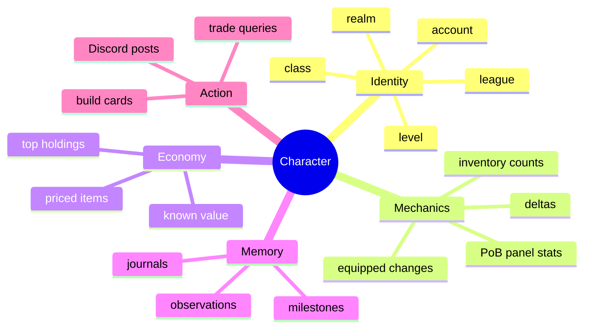

## Appendix C: Immediate Operational Reminder

The active repo default remains:

```bash
DEFAULT_ACCOUNT="tinycrops#3233"
DEFAULT_CHARACTER="PhysicalDamage"
DEFAULT_LEAGUE="Mirage"
DEFAULT_REALM="pc"
DEFAULT_TRADE_MODE="securable"
```

Before progression-sensitive recommendations for `PhysicalDamage`, refresh the character with `poe_stat_watch.py` so the ledger’s `latest_snapshot` is no longer stale or empty.
